autoscale: true
footer: @pydanny / Kraken Technology :octopus:
slidenumbers: true
slide-transition: true


# [fit] No Holds Barred

# [fit] Web Framework Battle

## Daniel Roy Greenfeld

---


# [fit] No Holds Barred

# [fit] Web Framework Battle

## Daniel Roy Greenfeld

---

# [fit] Hello Python Italy!

[.text: text-scale(0.5)]

[.column]


il Tricolore 


[.column]


By Markus Bernet - Own work, CC BY-SA 2.5

---

# [fit] About this talk

- Compare some Python web frameworks
- Compare them in ways that make sense for me
- My preferences may not be your preferences

---

# [fit] Addressing the question of

# [fit] Bias

---

[.background-color: #FF0000]
[.header: #FFFFFF, Avenir Next Bold]
[.text: #FFFFFF, Avenir Next Bold]

# [fit]My nickname isn't

# [fit] "Django Daniel"

---

[.background-color: #ecd540]

# [fit] My nickname is

# [fit] "pydanny"

---

# Quick review of my Python web work

[.column]

# Django

- 5 editions of Two Scoops of Django
- 1 edition of Django Crash Course
- 233 articles: [daniel.feldroy.com/tags/django](https://daniel.feldroy.com/tags/django)
- Countless open source contributions
- Oodles of production projects

[.column]

## FastAPI / Flask / Pyramid

- 3 FastAPI Articles: [daniel.feldroy.com/tags/fastapi](https://daniel.feldroy.com/tags/fastapi)
- 5 Flask Articles: [https://daniel.feldroy.com/tags/flask](daniel.feldroy.com/tags/flask)
- 8 Pyramid Articles: [https://daniel.feldroy.com/tags/pyramid](daniel.feldroy.com/tags/pyramid)
- About 15 production projects

[.column]

# Zope/Plone

- 74 Plone articles: [daniel.feldroy.com/tags/plone](https://daniel.feldroy.com/tags/plone)
- 38 Zope articles: [daniel.feldroy.com/tags/zope](https://daniel.feldroy.com/tags/zope)
- 2 production projects

---

# [fit] **I tend to write more about**

# [fit] **what I'm being paid to work on**


---

# Yes, I've written a lot about Django

- After 14 years I know the pain points of Django
- I've used Flask for 12 years
- I've used FastAPI for 3 years
- I did Zope/Plone for 4 years @ NASA :rocket:
- I've used Pyramid off-and-on for 17 years
- I used Tornado a few times in 2014

---

# [fit] Which frameworks am I covering?

The ones I considered

[.column]

- Django
- FastAPI
- Flask
- Pyramid
- Tornado

[.column]

---

# [fit] Which frameworks am I covering?

The ones I chose

[.column]

- Django :white_check_mark:
- FastAPI :white_check_mark:
- Flask :white_check_mark:
- Pyramid
- Tornado

[.column]

Popularity and usage is at least an order of magnitude higher than other python frameworks.

---

# [fit] I like all three frameworks

[.column]

# Django is awesome

# FastAPI is awesome

# Flask is awesome

[.column]

You can win with any of these frameworks.

Mad respect to the authors and contributors.

# [fit] :sparkling_heart:

---

# [fit] Ready?

# Let's dive in

---

[.background-color: #ecd540]

# Quick overview of the frameworks

---

# Django

- Released: 2005
- Full-stack web framework
  - Web-serving, databases, HTML generation
- Bundled with ORM & form validation
- Admin tool driven by ORM & form systems
- Larger than the other frameworks

---

# FastAPI

- Released: 2018
- Almost Microframework
  - Data validation: tightly integrated with pydantic
- Uses type annotations as a superpower
- Async from the start

---

# Flask

- Released: April 1, 2010
- Microframework
  - Minimal core, lots of extensions
- Very popular with SaaS vendors for tutorials

---

# [fit] Points of Comparison

[.column]

- Developer Experience
- Speed
- Async Support

[.column]

- Databases
- Governance
- Sweet Spots


---


# [fit] Developer Experience

- **Getting started**
- **Data validation**
- **Small projects**
- **Large projects**

---


# **Developer Experience**

## **Getting started**

---

# Developer Experience

## Getting started

[.column]

# Django :-1:

```python
# urls.py
# Not including a bunch of setup
# No one builds Django projects this way
from django.urls import path
from django.views.generic import View

def index(request):
    return "Index Page"

def hello(request):
    return "Hello, World"

urlpatterns = [
    path('', index, name='home'),
    path('/hello', hello, name='home'),
]
```

[.column]

# **FastAPI** :+1:

```python
# app.py
from fastapi import FastAPI

app = FastAPI()

@app.get("/")
def index():
    return {"Index": "Page"}

@app.get("/hello")
def hello():
    return {"Hello": "World"}
```

[.column]

# **Flask** :+1:

```python
# app.py
# Flask can also return
# JSON by returning dict
from flask import Flask

app = Flask(__name__)

@app.route('/')
def index():
    return 'Index Page'

@app.route('/hello')
def hello():
    return 'Hello, World'
```

---

# Developer Experience:

## Getting started

[.column]

# Django :-1:

- No such thing as a quickstart in Django
- Tutorial is good, just takes time

[.column]

# FastAPI :+1: :-1:

- Easy to get started
- [Quickstart](https://fastapi.tiangolo.com/tutorial/first-steps/) needs work

[.column]

# **Flask** :+1: :+1:

- Easy to get started
- Flask's [quickstart](https://flask.palletsprojects.com/en/2.2.x/quickstart/) is amazing
- Quickstart covers everything many small projects need
- Quickstart is technically a cheatsheet

---

[.background-color: #90ee90]

# Developer Experience:

## Getting started

# [fit] Winner: Flask

---


# **Developer Experience**

## **Incoming data validation**

---

# Developer Experience

## Incoming data validation

[.column]

# **Django** :+1:

```python
from django import forms
from django.views.generic import CreateView
from django.contrib.auth.mixins import (
    LoginRequiredMixin
)

from .models import Cheese


class CheeseForm(forms.Form):
    name = forms.CharField(max_length=100)
    description = forms.CharField(
        max_length=300,
        required=False
    )
    age = forms.IntegerField(
        default=0
        min_value=0,
        description="Age in months"
    )


class CheeseCreateView(LoginRequiredMixin, CreateView):
    model = Cheese
    form_class = CheeseForm

    def form_valid(self, form):
        form.instance.creator = self.request.user
        return super().form_valid(form)

```

[.column]

# **FastAPI** :+1:

```python
from fastapi import FastAPI
from pydantic import BaseModel, Field

app = FastAPI()


class Cheese(BaseModel):
    name: str
    description: str = Field(
        default=None,
        title="The description of the item",
        max_length=300)
    age: int = Field(
        default=0,
        gt=0,
        description="Age in months"
    )

@app.post("/cheeses/")
async def update_item(cheese: Cheese):
    return Cheese
```

[.column]

# **Flask** :-1:

- No built-in validation
- flask-wtf is awesome, but no mention in core docs
- Documentation doesn't encourage data validation

---

# Developer Experience

## Incoming data validation

[.column]

# Django :+1:

- Comes with built-in validation
- Powered by Django's Forms and ORM
- Edge cases require digging
- Encouraged, but not forced

[.column]

# **FastAPI** :+1: :+1:

- Comes with built-in validation
- Powered by the pydantic library, which is awesome
- Type annotations makes it intuitive
- Forces use of validation

[.column]

# Flask :-1:

- No built-in validation
- Documentation doesn't encourage data validation
- flask-wtf is awesome, but no mention in core docs

---

[.background-color: #90ee90]

# Developer Experience

## Data Validation

# [fit] Winner: FastAPI

---


# **Developer Experience**

## **Small projects**

---

# Developer Experience

## **Small projects**

[.column]

# Django :+1: :-1:

- Admin tool is great for small projects with SQL databases
- Overkill for projects without SQL databases
- Single file apps require advanced knowledge of Django

[.column]

# **FastAPI** :+1: :+1:

- Light and easy to get started
- One file apps are easy to build
- Flexibility on databases is a virtue
- Built-in validation
- Built-in REST API is awesome

[.column]

# Flask :+1:

- Light and easy to get started
- One file apps are easy to build
- Flexibility on databases is a virtue

---

[.background-color: #90ee90]

# Developer Experience

## Small projects

# [fit] Winner: FastAPI

---


# **Developer Experience**

## **Large projects**

---

# Developer Experience

## Large projects

[.column]

# **Django** :+1: :+1:

- "app" structure forced by Framework
- Described in core tutorial
- Each app supports a specific feature
- Each app has its own models, views, forms, etc.
- Borrowed from POSIX philosophy

[.column]

# Flask :+1:

- Core docs
- Each blueprint supports a specific feature
- Each blueprint has its own models, views, forms, etc.
- In my experience, rarely used

[.column]

## FastAPI :+1: :-1:

- No guidance provided
- Framework design encourages separation of concerns

---

[.background-color: #90ee90]

# Developer Experience

## Large projects

# [fit] Winner: Django

---

# Developer Experience Summary

| Category        | **Django**         | **FastAPI**        | **Flask**          |
| --------------- | ------------------ | ------------------ | ------------------ |
| Getting started |                    |                    | :white_check_mark: |
| Data validation |                    | :white_check_mark: |                    |
| Small projects  |                    | :white_check_mark: |                    |
| Large projects  | :white_check_mark: |                    |                    |

---

[.background-color: #00FF00]

# Developer Experience

## Aggregate

# [fit] Winner: FastAPI

---

[.header: #000000, text-scale(2.0)]

# [fit] Speed


---

# About speed metrics

- Often the database is the bottleneck real projects face
- Indexing and caching are often the best ways to improve performance rather than changing the framework

---

# "Lies, Damn Lies and Statistics"

- Different benchmarks use different tools
- Conditions in tests are often misleading
- Example: Comparing **Django** with queries to **FastAPI/Flask** with no database access

---


# [fit] Speed

## [fit] **JSON Serialization**

---

# Speed

## JSON Serialization

Each response is a JSON serialization of a freshly-instantiated object that maps the key message to the value Hello, World!

Example response:

```
HTTP/1.1 200 OK
Content-Type: application/json
Content-Length: 28
Server: Example
Date: Wed, 17 Apr 2013 12:00:00 GMT

{"message":"Hello, World!"}
```

---

# Speed

## JSON Serialization

### [techempower.com/benchmarks/#section=data-r21&test=json](https://www.techempower.com/benchmarks/#section=data-r21&test=json)

[.column]

# Django :+1:

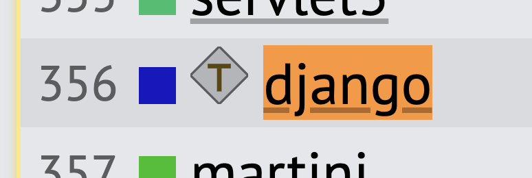

[.column]

# **FastAPI** :+1: :+1:

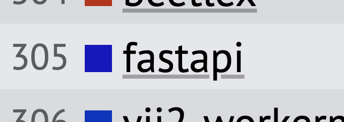

[.column]

# Flask :question: :heavy_exclamation_mark:

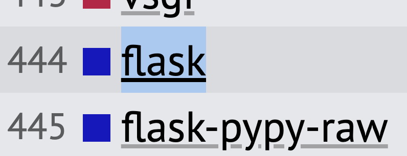

---


# [fit] Speed

## [fit] Fortunes

---

# Speed

## Fortunes

- The framework's ORM is used to fetch all rows from a database table containing an unknown number of Unix fortune cookie messages (the table has 12 rows, but the code cannot have foreknowledge of the table's size).
- An additional fortune cookie message is inserted into the list at runtime and then the list is sorted by the message text.
- The list is delivered to the client using a server-side HTML template.
- The message text must be considered untrusted and properly escaped and the UTF-8 fortune messages must be rendered properly.
- Whitespace is optional and may comply with the framework's best practices.

```
HTTP/1.1 200 OK
Content-Length: 1196
Content-Type: text/html; charset=UTF-8
Server: Example
Date: Wed, 17 Apr 2013 12:00:00 GMT

<!DOCTYPE html><html><head><title>Fortunes</title></head><body>...
```

---

# Speed

## Fortunes

### [techempower.com/benchmarks/#section=data-r21&test=fortunen](https://www.techempower.com/benchmarks/#section=data-r21&test=fortune)

[.column]

# Django :+1:

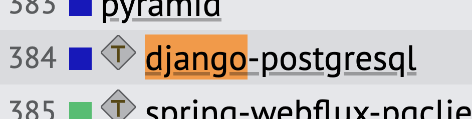

[.column]

# **FastAPI** :+1: :+1:

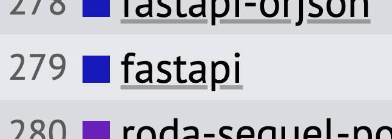

[.column]

# Flask :+1: :question:

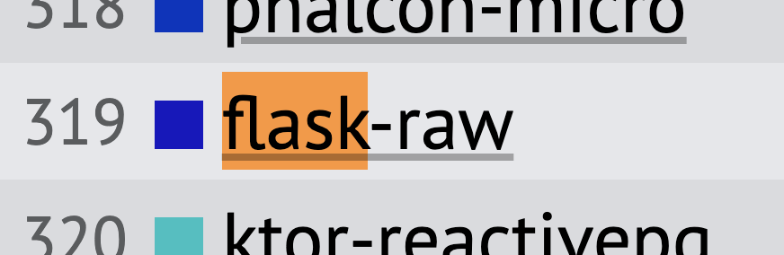

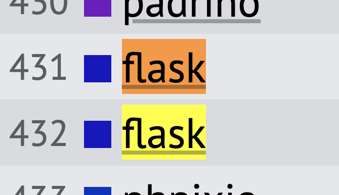

---

# [fit] Speed

## [fit] Composite


---

# Speed

## Composite

### [techempower.com/benchmarks/#section=data-r21&test=composite](https://www.techempower.com/benchmarks/#section=data-r21&test=composite)

[.column]

# Django :+1:

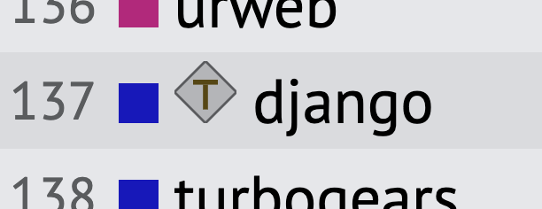

[.column]

# FastAPI :+1:

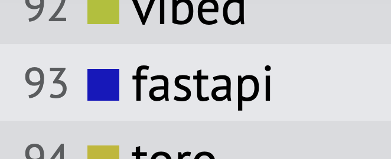

[.column]

# **Flask** :+1: :+1:

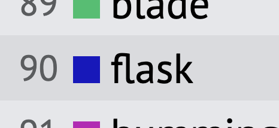

---

# Apples and Oranges

So many variables that it's easy to get lost in the weeds.

1. FastAPI is really fast with JSON serialization
2. Flask tends to have better composite scores
3. Django run as a single file app without middleware, context processors, etc is comparable to Flask and FastAPI

---

# Speed Summary

Source: [techempower.com/benchmarks/](https://www.techempower.com/benchmarks/)

[.column]

# Django :-1:

- Usually slowest of the big three Python frameworks
- Removing critical components to increase speed is a fool's errand

[.column]

# **FastAPI** :+1:

- Fastest JSON serialization
- Fastest async
- Will get a boost with advent of pydantic 2.0

[.column]

# **Flask** :+1:

- Faster with templates & queries

---

[.background-color: #00FF00]

# Speed

# [fit] Winner: Flask & FastAPI

---

[.header: #000000, text-scale(2.0)]

# [fit] Async

# [fit] Support


---

# Async Support

## Why it matters

[.column]

- Websockets
- Blocking I/O
  - File streaming
  - Slow APIs
  - Tarpits

[.column]

---

# Async Support

[.column]

# Django :+1:

- Herculean effort to bring async support to Django
- Not for beginners
- [Docs](https://docs.djangoproject.com/en/4.2/topics/async/) cover the fundamentals, but not much else
- Nifty `sync_to_async()` decorator
- Much of ecosystem is synchronous

[.column]

# **FastAPI** :+1: :+1:

- Designed from the outset to support async
- All of the framework is async by default
- [Good documentation](https://fastapi.tiangolo.com/async/)

[.column]

# Flask :+1:

- Slow, hence [recommendation](https://flask.palletsprojects.com/en/2.2.x/async-await/#when-to-use-quart-instead) to use Quart instead
- Modern Flask supports async
- [Light documentation](https://flask.palletsprojects.com/en/2.2.x/async-await/)
- Much of Flask and ecosystem is synchronous

---

[.background-color: #00FF00]

# Async

# [fit] Winner: FastAPI

---

[.header: #000000, text-scale(2.0)]

# **Databases**


---

# Databases I like to use

- Relational Databases (SQL for short)
- DynamoDB, specifically single-table designs
- Firebase, especially in hackathons

---

# Databases

[.column]

# **Django** :+1:

- Designed for SQL databases
- Key/value stores used for caching
- Universality of SQL empowers the package ecosystem
- [Using No-SQL is always a mistake](https://daniel.feldroy.com/posts/when-to-use-mongodb-with-django)

[.column]

# **FastAPI** :+1:

- Use whatever you want

- Or skip the database entirely

[.column]

# **Flask** :+1:

- Use whatever you want

- Or skip the database entirely

---

[.background-color: #00FF00]

# Databases

# [fit] Winner: Tie

---

[.header: #000000, text-scale(2.0)]

# **Governance**


---

# Governance

[.column]

# **Django** :+1:

- Shared governance

[.column]

# FastAPI :-1:

- Sebastian Tiangelo Ramirez
- Cool mustache

[.column]

# **Flask** :+1:

- Shared governance

---

[.background-color: #00FF00]

# Governance

# [fit] Winner: Django & Flask

---


[.header: #000000, text-scale(2.0)]

# **Sweet Spots**


---

# Sweet Spots

[.column]

# **Django** :+1: :+1:

- Large projects
- Admin
- Third-party packages
- Django Templates + HTMX

[.column]

# **FastAPI** :+1: :+1:

- REST/JSON APIs
- Small projects
- Async
- Elegant design

[.column]

# Flask

- Small projects

---

[.background-color: #00FF00]

# Sweet Spots

# [fit] Winner: Django & FastAPI

---

[.background-color: #ecd540]

# [fit] Conclusion

# (what do I use on new projects?)

---

# [fit] I like all three frameworks

[.column]

# Django is awesome

# FastAPI is awesome

# Flask is awesome

[.column]

You can win with any of these frameworks.

Mad respect to the authors and contributors.

# [fit] :sparkling_heart:

---

# There can only be one!


---

# Django or FastAPI or Flask?

| Category             | **Django**         | **FastAPI**        | **Flask**          |
| -------------------- | ------------------ | ------------------ | ------------------ |
| Developer Experience |                    | :white_check_mark: |                    |
| Performance          |                    | :white_check_mark: | :white_check_mark: |
| Async Support        |                    | :white_check_mark: |                    |
| Databases            | :white_check_mark: | :white_check_mark: | :white_check_mark: |
| Governance            | :white_check_mark: | | :white_check_mark: |
| Sweet Spots          | :white_check_mark: | :white_check_mark: |                    |

---

[.background-color: #00FF00]

# Grand Winner

# [fit] Winner: FastAPI

<br>

[.column]

Where FastAPI can improve:

- Quickstart
- Large projects
- Governance

[.column]

About the runner-ups:

- Django is great
- Flask is great


---

# About Me

[.column]

Daniel Roy Greenfeld

Code @ Kraken Technologies :octopus:

Author, Coder, Leader

Husband of Audrey Roy Greenfeld

Father

Superhero saving the planet

[.column]


---

# Looking for work that


# makes a difference?

---

 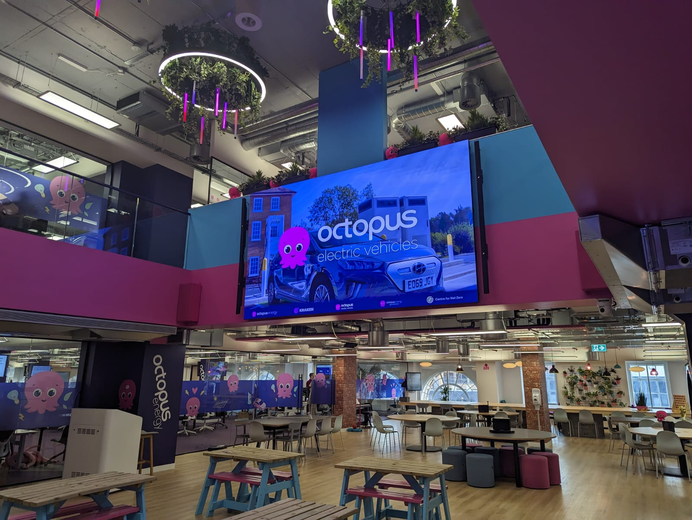

 

---

[.background-color: #180048]
[.header: #FFFFFF]

# [fit] Join me in the battle against climate change

[.column]

<br>

### Octopus Energy Group is hiring

### [octopus.energy/careers](https://octopus.energy/careers/join-us/#/)

[.column]

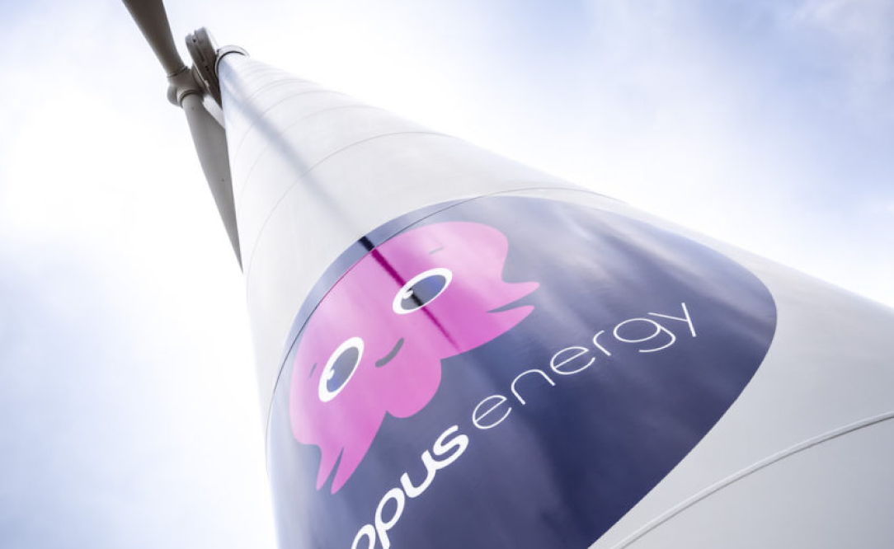

---


# [fit] **Questions?**

