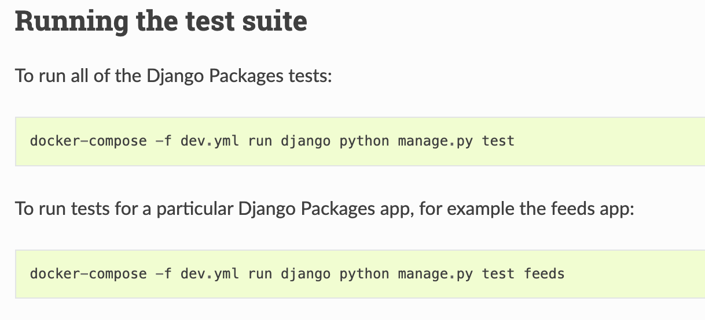

autoscale: true

# [fit] Confessions of Joe Developer

Daniel Roy Greenfeld

---

# [fit] Confessions of Joe Developer

Daniel Roy Greenfeld

---

# [fit] 2004


---

# Scheduled Interview at NASA


---

# [fit] 😞

# [fit] No way I was going to work for the agency

---

# [fit] No way I was going to work for the agency

- No computer science degree

- Only 7 years professional experience

---

# [fit] Plan

---

# [fit] Treat interview as a practice session


---

# [fit] Test new approaches to typical questions


---

# [fit] Have fun!

---

# [fit] How it went

---

# [fit] **"What's your biggest weakness?"**

## - NASA Interviewer

---

<br><br>

# **"My biggest weakness is that I'm emotionally tied to my work so if I'm not doing well I take it personally. Then I work longer and harder to improve."**

## - My normal response

---

# Critical question from NASA interviewer:

<br>

# [fit] "What's your biggest weakness?"

---

# This time:

<br>

# "I'm stupid and lazy"

---

# This time:

<br>

# [fit] "I'm stupid and lazy"

---

# NASA Interviewer

<br>

# [fit] "WTF?!"

---

# NASA Interviewer

<br>

# [fit] "You going to explain that?"

---

# [fit] I'm stupid

---

# I'm stupid

- Can't figure things out
- Can't remember things
- Too stupid not to ask stupid questions

---

# [fit] Let's go over each item in this list

---

# I'm stupid

## Can't figure things out

### Always look first on PyPI or GitHub for libraries to do the work

---

# Can't figure things out

## OMG argparse

```python
import argparse

# sub-command functions
def foo(args):
    print(args.x * args.y)

def bar(args):
    print('((%s))' % args.z)

# create the top-level parser
parser = argparse.ArgumentParser()
subparsers = parser.add_subparsers()

# create the parser for the "foo" command
parser_foo = subparsers.add_parser('foo')
parser_foo.add_argument('-x', type=int, default=1)
parser_foo.add_argument('y', type=float)
parser_foo.set_defaults(func=foo)

# create the parser for the "bar" command
parser_bar = subparsers.add_parser('bar')
parser_bar.add_argument('z')
parser_bar.set_defaults(func=bar)

parser.parse_args()
```

---

## Can't figure things out

### So I use libraries like typer

```python
import typer

app = typer.Typer()


@app.command()
def foo(y: float, x: int = 1 ):
    print(x * y)

@app.command()
def bar(z: str):
    print(f'(({z}))')


if __name__ == '__main__':
    app()
```

---

# I'm stupid

## Too stupid not to ask stupid questions

---

# I'm stupid

## Too stupid not to ask stupid questions

# There are no stupid questions

---

# Don't try to impress people by not asking questions

---

## No one cares

## No one remembers

---

## Too stupid not to ask stupid questions

# Obey the Thirty Minute Rule

# [fit] [daniel.feldroy.com/30](https://daniel.feldroy.com/30-minute-rule)


---

# Obey the Thirty Minute Rule

## Don't waste more than 30 minutes on a problem without asking questions

---

# Obey the Thirty Minute Rule

## Change to 60 minutes if you like

---


---

# Hint: Don't be a jerk and not let other people ask questions

---

# I'm stupid

## Can't remember things

---

## Can't remember things

# Docstrings are awesome

---

## Can't remember things

# Typehints are awesome too, use them to reduce docstrings

---

# Remember this?

## Typehints means we don't have to write so many docs

```python
import typer

app = typer.Typer()


@app.command()
def foo(y: float, x: int = 1 ):
    print(x * y)

@app.command()
def bar(z: str):
    print(f'(({z}))')


if __name__ == '__main__':
    app()
```

---

## Can't remember things

# Use markdown because of ease/portability

- Even when I constantly wrote in RST I had to look stuff up
- Markdown is just easier to learn
- Reduce friction in your docs!

---

### Can't remember things

## When following a talk or tutorial,

# Write down even the slide bullets!

---

# For some people writing down notes enhances learning

---

# I'm stupid

## Can't remember things

Me back in the day:

- [pydanny-event-notes.readthedocs.io/](https://pydanny-event-notes.readthedocs.io/)
- [daniel.feldroy.com/posts/2011-12-story-of-live-noting](https://daniel.feldroy.com/posts/2011-12-story-of-live-noting)

---

# I'm stupid

## Can't remember things

Documentation makes me look good!

- Writing stuff down helps me remember
- Can be used later for things like writing books

TODO add Two Scoops of Django image

---

# I'm stupid

## Can't remember things

Documentation can you look good too:

- https://docs.python-requests.org/
- https://fastapi.tiangolo.com/

---

# [fit] I'm lazy

---

# I'm lazy

- Don't wanna do anything twice
- Don't wanna debug code when I had it working before
- Don't wanna look hard for docs

---

# I'm lazy

## Don't wanna do anything twice

- If I write the same code twice I stick in a function
- I use typehints so I don't have to write so much docs
- Then I stick the function into a `utils` module
- Then I put it on GitHub so I don't lose it
- Isn't this the foundation of open source?

---

[.build-lists: true]

# I'm lazy

## Don't wanna debug code when I had it working before

- Manually testing code by watching it run is hard
- ...and boring
- ...and hence is error prone
- ...meaning you have to do more work

---

# I'm lazy

## Don't wanna debug code when I had it working before

### Write down how to test in case you forget



---

# I'm lazy

## Don't wanna look hard for docs

- Every project should have a README
- Longer form docs should use:
  - readthedocs.io
  - GitHub pages
  - Whatever

---

# [fit] Did I get the job at NASA?

---

# [fit] Yes

---

# [fit] In hindsight I was lucky

---

# My history at NASA

- Started in 2005, ended in 2010
- Learning Python and Django
- Started what became django-crispy-forms
- Met my wife
- Learned a lot more about climate change

---

# [fit] We're too stupid and lazy to...

---

# [fit] ...go to other Planets

---

# [fit] Budgets

- US Military: $715 billion
  - Military space budget: $15 billion
- NASA: $24.8 billion

## NASA's budget is 3.4% of the US military budget

---

# [fit] We're not going anywhere

---

# [fit] Let's fix the Planet

---

# Let's fix the Planet

- Earth is going to get worse to live in before it gets better
- Let's work to fight against climate change
- Use our skills to end fossil fuel dependency

---

# [fit] How we can use our stupid, lazy skills

---

# How we can use our stupid, lazy skills

- Work for renewable energy companies
- Join fintech companies focused on green initiatives
- Build tech to make us live more efficiently
- Come work with me

---

# [fit] Tossing my hat in the ring

---

# Come and work with me at Octopus Energy Group

- Come and work with me at Octopus Energy Group
  - Sell renewable energy to the people
  -
