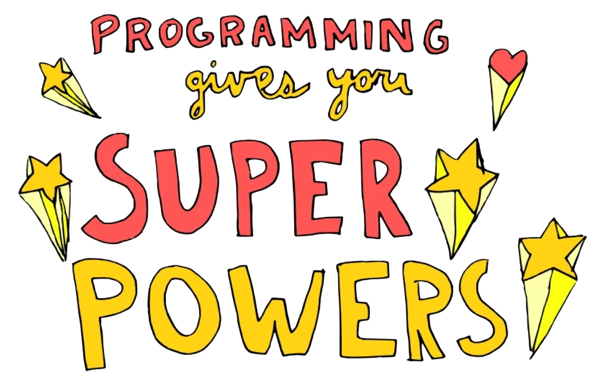

autoscale: true
footer: @pydanny / feldroy.com / kraken tech :octopus:
slidenumbers: true
slide-transition: true

# [fit] Glorious Mistakes

# [fit] 25 years of Python Errors

## Daniel Roy Greenfeld

---

# [fit] Glorious Mistakes

# [fit] 25 years of Python Errors

## Daniel Roy Greenfeld

---

# [fit] Hello Lithuania!


---

[.background-color: #000000]
[.header: #FFFFFF]
[.text: #FFFFFF]

# [fit] Thank you!


---

# [fit] This is my first time here


---

Hello Lithuania!

[.column]

# [fit] 100+ years

# Since family left

[.column]


---

# My mother loves Šaltibarščiai[^1]

[.column]


[.column]

### [fit] Hi Mom!

[^1]: shalt-eh-barsh-chay

---

[.background-color: #000000]
[.header: #FFFFFF]

# [fit] Thank you!


## Aidis and the whole team

[.text: #FFFFFF]

---

# [fit] Let's do this!

---

# [fit] Glorious Mistakes

# [fit] 25 years of Python Errors

## Daniel Roy Greenfeld

---

# [fit] About these errors

---

# [fit] Some are

# [fit] mine

---

# [fit] Some I 

# [fit] witnessed

---

# [fit] Some I

# [fit] fixed

---

# [fit] Some I'm

# [fit] fixing

---

# [fit] Some are 

# [fit] ongoing


---

[.background-color: #FF0000]
[.header: #FFFFFF, Avenir Next Bold]
[.text: #FFFFFF, Avenir Next Bold]

# 1.

# [fit] Missed opportunity of lifetime

---

# 1999

# [fit] Scheduled an interview

---

# [fit] At a :snake: company!

---

[.column]

# [fit] 1999

[.column]


---

# 1999: Could have worked at Zope Corp

[.column]


[.column]


---

# [fit] However,

---

# [fit] this is 1999

---


---

# [fit] :snake:

# is a weird, obscure language

---


#  1999: Real coders use Java Enterprise! 

[.column]

Big companies excited about Java

Unnecessary complexity was a virtue

XML everywhere!

[.column]


---

# Senior dev:

# "Python is a MISTAKE"

---


---


[.background-color: #FF0000]
[.header: #FFFFFF, Avenir Next Bold]
[.text: #FFFFFF, Avenir Next Bold]

# [fit] I cancelled

# [fit] the interview!

---

# What I missed

# by cancelling an interview


---

[.column]

### Zope was hiring most of the Python devs


[.column]

### Including GvR in 2000!


---

[.column]

# At the start of my career  I lost the chance to work with Guido van Rossum

[.column]


---

[.column]

At a time when Python was so new Guido (and others experts there) spent untold hours lifting up people like me.

^ This would have been a huge career jump for me, instead of languishing for 7 years in enterprise environments.

[.column]


---

[.background-color: #FF0000]
[.header: #FFFFFF, Avenir Next Bold]
[.text: #FFFFFF, Avenir Next Bold]

# 1.

# [fit] Missed opportunity of lifetime

---

## Lessons Learned

1. Always go to the interview!
2. Don't listen to people who dismiss Python

<sub>[daniel.feldroy.com/posts/2010-01-my-pre-history-with-plone](https://daniel.feldroy.com/posts/2010-01-my-pre-history-with-plone)</sub>

---

# [fit] Second Mistake

---

[.background-color: #FF0000]
[.header: #FFFFFF, Avenir Next Bold]
[.text: #FFFFFF, Avenir Next Bold]

# 2.

# Unnecessary Sophistication

---

## Late 1990s to 2008-ish

# The Age of Zope

---

# What is Zope?


---

# What is Zope?

A consulting company

---

# What is Zope?

A pioneering web framework

---

# What is Zope?

## A pioneering web framework

Invented URL routing 

```
$ tree .
├── accounts.cfm
├── index.php
├── users.pl
```

---

# What is Zope?

## A pioneering web framework

Built-in admin


---

# What is Zope?

## A pioneering web framework

NoSQL Database

- A pickled, indexed Python object!

- Powered by B-Trees!


---

# What is Zope?

## A pioneering web framework

Even Typing!

Plus many more features

---

[.build-lists: true]

# Zope dominated Python

- Zope was synonymous with Python web
- Early PyCon US had a Zope track

---

# [fit] Zope

# [fit] dominated

# [fit] Python

---

# [fit] What happened to Zope?

---

[.build-lists: true]

# What happened to Zope?

Created in the era where complexity equaled value

---

# What happened to Zope?

XML was in fashion: Making things public using Zope[^3]

```xml
<browser:page name="captcha.wav"
  for="captchad.interfaces.ICaptchaContainer"
  class="captchad.browser.folder.CaptchaAudio"
  permission="zope.Public" />

<browser:page
  name="captcha.png"
  for="captchad.interfaces.ICaptchaContainer"
  class="captchad.browser.folder.CaptchaImage"
  permission="zope.Public" />
```

[^3]: https://daniel.feldroy.com/posts/2007-11-im-serving-out-image-and-audio-files

---

[.column]

# Zope

```xml
<browser:page name="captcha.wav"
  for="captchad.interfaces.ICaptchaContainer"
  class="captchad.browser.folder.CaptchaAudio"
  permission="zope.Public" />

<browser:page
  name="captcha.png"
  for="captchad.interfaces.ICaptchaContainer"
  class="captchad.browser.folder.CaptchaImage"
  permission="zope.Public" />
```

[.column]

# Django CBVs 

```python
class PublicCaptchaView(
        DetailView
    ):
    # Public by default

class PrivateCaptchaView(
        DetailView,
        LoginRequiredMixin
    ):
    # Private with mixin
```

---

# What happened to Zope?

Easy things were hard, hard things were nigh impossible

---


# Becoming proficient with Zope required:

A large investment of time

Expedited via paid instruction or employment with core contributors

---

# Popular frameworks using Zope added more complexity

- Plone
- Nuxeo

(The large investment of time became huge)

---

# Zope Hiring Story at NASA

[.column]

In 2008 at NASA my team rejected a candidate in part because he made the impossible claim to have learned, coded, and deployed a Zope-powered system within a month.

[.column]


---

# Example Zope Gotcha

Impossible claim: Zope had too many one-off quirks:

```python
from datetime.datetime import DateTime
from zope.schema import Datetime
from zope.schema import TextLine
```

[daniel.feldroy.com/posts/2007-11-head-meets-desk](https://daniel.feldroy.com/posts/2007-11-head-meets-desk)

---

[.code-highlight: 2]

# Example Zope Gotcha

Impossible claim: Zope had too many one-off quirks:

```python
from datetime.datetime import DateTime
from zope.schema import Datetime  # <-- Titlecase
from zope.schema import TextLine
```

[daniel.feldroy.com/posts/2007-11-head-meets-desk](https://daniel.feldroy.com/posts/2007-11-head-meets-desk)

---

# Example Zope Gotcha

Impossible claim: Zope had too many one-off quirks:

```python
from datetime.datetime import DateTime
from zope.schema import Datetime  # <-- Titlecase
from zope.schema import TextLine  # <-- Camelcase
```

[daniel.feldroy.com/posts/2007-11-head-meets-desk](https://daniel.feldroy.com/posts/2007-11-head-meets-desk)


---

[.build-lists: true]

## Unfortunately common Zope dialogue

1. Coder: "This is really hard and the docs are incomplete"

2. Contributor: "Take my paid class to understand it"

3. Coder: "Can we not use XML so much?"

4. Contributor: "Here's more complexity and XML!"

5. Coder: "Bah! I'm going to use something else"

---

## My Zope story wasn't unique

---

[.build-lists: true]

# My Zope story

1. 2007 - Zope is kind of neat. 
2. 2008 - Uh... easy things are hard and hard things impossible.
3. 2009 - Django allows me to get stuff done on schedule.

---

# The community

# drifted away

# to Django

---

# New community members

# went right to Django

---

# Lessons learned

1. Complexity as a business model is bad
2. Overcomplicating projects to sell training and consulting and ensure job security can backfire

<!-- ---

# Some footnotes about Zope

1. Zope appears to have removed some of the unnecessary complexity
1. typing.Protocol is directly inspired Zope subtypes
1. I fond memories of working directly with ZPT and ZODB -->

---

# [fit] Third Mistake

---

[.background-color: #FF0000]
[.header: #FFFFFF, Avenir Next Bold]
[.text: #FFFFFF, Avenir Next Bold]

# 3.

# Overly clever hacks


---

# My obnoxiously clever hack

I defined my own numeric variables called `true` and `false`

```python
# business/logic.py
true = 0
false = 1
```

---

Almost-but-not the breaks Python true/false contract

```python
true = 0                # falsy
false = 1               # truthy

True, [1], "Hi", {1: 2} # truthy
False, [], ""  , {}     # falsy
```


---

### Obnoxiously Clever!

```python
from business import logic, true, false

def process_result(vendorResponse):
    result = None
    for res in vendorResponse.results:
        if res.status == false:
            result = logic(res)
        if result.is_valid == True
            break
    return result
```

---

[.code-highlight: 6,8]

### My code confused everyone around (including me)

```python
from business import logic, true, false

def process_result(vendorResponse):
    result = None
    for res in vendorResponse.results:
        if res.status == false:  # Truthy value
            result = logic(res)
        if result.is_valid == True # Truthy value
            break
    return result
```

---

[.code-highlight: 6,8]

### My code confused everyone around (including me)

```python
from business import logic, true, false

def process_result(vendorResponse):
    result = None
    for res in vendorResponse.results:
        if res.status == false: # no code highlighting!
            result = logic(res)
        if result.is_valid == True # Code highlighting! 
            break
    return result
```

--- 

# What I broke

# by reversing booleans


---

[.background-color: #000000]
[.header: #FFFFFF]


## What I broke by reversing booleans


---

[.background-color: #000000]
[.header: #FFFFFF]

## Repeatedly


---

[.background-color: #000000]
[.header: #FFFFFF]

## So bad


---

[.background-color: #000000]
[.header: #FFFFFF]

## It took me 17 years to admit this error 


---

## A better approach

```python
class VendorStatus(Enum):
    POSITIVE: int = 0
    NEGATIVE: int = 1
```

---

## This mistake...

```python
from business import logic, true, false

def process_result(vendorResponse):
    result = None
    for res in vendorResponse.results:
        if res.status == false: # WTF was I doing?
            result = logic(res)
        if result.is_valid == True
            break
    return result
```

---

## Becomes a better approach

```python
from business import logic, VendorStatus

def process_result(vendorResponse):
    result = None
    for res in vendor_response.results:
        if res.status == VendorStatus.NEGATIVE:
            result = logic(res)
        if result.is_valid == True
            break
    return result
```

---

## A better approach

[.code-highlight: 6,8]

```python
from business import logic, VendorStatus

def process_result(vendorResponse):
    result = None
    for res in vendor_response.results:
        if res.status == VendorStatus.NEGATIVE:
            result = logic(res)
        if result.is_valid == True
            break
    return result
```

---

[.build-lists: true]

## What I learned:

1. Python code should be intuitive

2. Code shouldn't require three cups of coffee to be understood

3. Clever architecture is better when the editor flags it
    - Code highlighting
    - ALLCAPS

<!-- 3. Code that is too hard, rewrite it such that a beginner can understand it -->

<!-- 1. Business rules are often complex
2. Code should remain as simple as possible
3. Be wary of coding culture that encourages complexity -->

---

# Fourth Mistake

---

[.background-color: #FF0000]
[.header: #FFFFFF, Avenir Next Bold]
[.text: #FFFFFF, Avenir Next Bold]

# 4.

# Django Cleverness

---

## 2012-era Django

[.column]

Dr. Ian Malcolm, Mathematician/Chaotician @ Jurassic Park


[.column]


---

# Cleverness of the era

---

## Mistake: Database configuring installed apps

```sql
--  SQL to fetch which app to load
select app_path from apps where app_id = {environ['APP_ID']}";
```

```python
# Dynamically loaded INSTALL_APPS
INSTALLED_APPS += [x['app_path'] for x in records]
```

---

# Better approach:

## Build your own plugin system

---

# Mistake: Removing None 

> Null pointer exceptions are a billion dollar mistake.

-- Tony Hoare

---

# Mistake: Removing None 

(I'm not going to argue with the inventor of Null Pointers)

---

# Mistake: Removing None 

However, replacing None in Python is questionable

```python
class NullPointerHandler:
    # 50+ lines of code goes here
```

---

# Mistake: Removing None 

`NullPointerHandler` decorates/wraps:

- Every Python stdlib that could return None

---
# Mistake: Removing None 

`NullPointerHandler` decorates/wraps:

- Every PyPI package that could return None

---

# Mistake: Removing None 

- OMG `NullPointerHandler` touches everything!

---

# Mistake: Removing None 

1. Edge case nightmares! 
2. Curious bottlenecks

---

# Better approach:

### If coding Python, don't worry about Null Pointer Exceptions

---

[.build-lists: true]

### Mistake: Cache-powered concrete models

- Caching to handle data duplication
- But cache invalidation is hard

---

### Mistake: Cache-powered concrete models

- Caching to handle data duplication
- But cache invalidation is hard

> "There are only two hard things in Computer Science: cache invalidation and naming things."
> -- Phil Karlton

---

# Better approach:

# Avoid concrete models

---

[.build-lists: true]

### Mistake: Hack MongoDB into Django

- Clever code addresses all but 20% of Django!
- Easy to get started!


- Often breaks most of the third-party package ecosystem
- Edge case insanity
- Maintainance issues

---

# Better approach:

# Use MongoDB with something besides Django[^m]

[^m]: https://daniel.feldroy.com/posts/when-to-use-mongodb-with-django

---

# [fit] So much cleverness!

---

# [fit] That was sarcasm

---

# [fit] The reality

---

[.background-color: #FF0000]
[.header: #FFFFFF, Avenir Next Bold]
[.text: #FFFFFF, Avenir Next Bold]

# This caused a lot of failing Django projects

---

# Most of our 2012 work was underpaid Django rescue work

Devs code impossible complexity

---

# Most of our 2012 work was underpaid Django rescue work

Devs leave because stuck and runway mostly gone

(runway means how long funding lasts)

---

# Most of our 2012 work was underpaid Django rescue work

We get invited to fix the problems on shoestring budgets

---

# If only people stopped the clever coding!

# [fit] :angry:

---

# There needs to be a guide for keep things reasonable

# [fit] 🤔

---

# Let's talk it over ice cream!

# [fit] :icecream::icecream:

---

# Two Scoops of Django!


---

# Two Scoops of Django

[.column]


[.column]


[.column]


---

# Two Scoops of Django

[.column]


[.column]


---

# Lesson Learned

We can address problems by writing and coding

---

# Let's move on...


---

[.background-color: #FF0000]
[.header: #FFFFFF, Avenir Next Bold]
[.text: #FFFFFF, Avenir Next Bold]

# 5.

# Modern Complexity

---

# [fit] Python Types
<br>

# Problem or not?

---

> "I like types but they aren't always good"
<br><br>

> David Seddon

---

# For control of behaviors Types are bliss

- FastAPI
- Typer
- pydantic

---

[.build-lists: true]

## Types can add significantly to cognitive load

- Yes, straightforward types improve clarity

- It's the edge cases that hurt

- Django is an edge case for Python types

    - FastAPI (or Django Ninja) makes this better

---

# Types are decent at catching bugs

---

# [fit] But

---

Saying:

# [fit] "Types catch bugs before they reach production

# [fit] so we can stop writing so many tests"

---

Is the same as:


# [fit] "The ORM means our 

# [fit] security is perfect" [^+]

[^+]: Crypto-dude at a hackathon in 2014

---

# Mypy is slow

## (Yes, I know there is a daemon)

1. If no cache, 93 lines of code takes me 5s
2. What if I'm testing millions of lines of Python?

---

# Upgrading mypy

# can be really hard

---

# Pro-tip:

# keep mypy up-to-date

---

Types

# [fit] add complexity

---

### I love protocols but admit for some this might be 'clever'

[.column]

```python
class Child(Protocol):
      name: str

      def play(self, game): ...

class Uma:
      name: int = 5

      def play(self, game):
        # Playtime goes here    

def playground(child: Child) -> None: ...
```

[.column]

```python
playground(Uma())  

# error: Argument 1 to "playground" has 
# incompatible type "Uma"; expected "Child"
    # note:  Following member(s) of "Uma" have conflicts:
    # note:      name: expected "str", got "int"
```

[^5]: [mypy.readthedocs.io/en/stable/protocols.html#invariance-of-protocol-attributes](https://mypy.readthedocs.io/en/stable/protocols.html#invariance-of-protocol-attributes)

---

# Remember Zope?


---

# Zope had Types

---

### `Zope.interface` preceded `typing.Protocol`[^6]

[.column]

```python
from zope.interface import Interface, Attribute

class IChild(Interface):

    name = Attribute("Name of person")

    def play(game):
        """Do some play"""
```

[.column]

```python
from zope.interface import implementer

@implementer(IChild)
class Child:

    name = 'Uma'

    def play(self, game):
        return work.start()
```

[^6]: https://peps.python.org/pep-0544/

---

[.background-color: #FF0000]
[.header: #FFFFFF, Avenir Next Bold]
[.text: #FFFFFF, Avenir Next Bold]

# Question:

## Are Python types the Zope of the 2020s?

---

[.build-lists: true]

# Problems with Python types

- Adding types to everything forces in the edge cases
- Cleverness required to get mypy to pass on some projects
- Typechecking is slow

---

Are Python types the Zope of the 2020s?

---

# I don't think so

---

[.column]

# [fit] Unlike

[.column]


---

# ...typing in Python has escape hatches

```python
from tying import Any

MyModel.name == generic_value  # type: ignore
```

---

Lessons learned:

1. Escape hatches are good

---

# Final error

---

[.background-color: #FF0000]
[.header: #FFFFFF, Avenir Next Bold]
[.text: #FFFFFF, Avenir Next Bold]

# 6.

# Not using Python for Good

---

# [fit] My work used for good

- People using it to land jobs and build dream projects
- Various community service efforts
  - Health care firms
  - Charities and non-profits

---

[.background-color: #FF0000]
[.header: #FFFFFF, Avenir Next Bold]
[.text: #FFFFFF, Avenir Next Bold]

# [fit] But what about when

# [fit] my work is used for

# [fit] evil?

---

[.build-lists: true]

[.background-color: #FF0000]
[.header: #FFFFFF, Avenir Next Bold]
[.text: #FFFFFF, Avenir Next Bold]

# [fit] My work used for evil!

- Logistics for nations who oppress their people
- Commercial ventures to spy on private citizens
- Promotion of stupidity: flat earth / no moon landing theories
- App to sell wildlife illegally

# :rage:

---

# [fit] Ethics in Code

[.column]

Dr. Ian Malcolm, Mathematician/Chaotician @ Jurassic Park


[.column]


---

# [fit] Questions we should ask

# [fit] of every employer/client

---

# [fit] Who is helped?

---

# [fit] Who is hurt?

---

# [fit] Does this project:

- Promote falsehood over truth?
- Subvert election processes?
- Intrude on individual sovreignty?
- Spew unnecessary carbon or methane into the atmosphere?

---

# [fit] In other words,

# [fit] does it help the future?

---

Let's try this on:

# [fit] Climate Change

---

# Climate change

- A series of incrementally hotter years
- Heat records broken annually
- Droughts in normally wet places

---

# Where is this? Southern California?


---

# No - This is Auburge, France in 2022


---

# [fit] It doesn't have to be this way...

---

## [fit] ...and here's why

---

Lessons learned thanks to our books:

- Programming gives us an outsized impact on the world
- We can make a difference

---



---

# [fit] Programming Gives Us Super Powers

To improve the lives of ourselves and our families

---

# [fit] Programming Gives Us Super Powers

To build new and innovative businesses


---

# [fit] Programming Gives Us Super Powers

To share ideas and knowledge around the world

---


---

[.column]

# [fit] We have the power 

# [fit] to save the planet


[.column]


---

[.background-color: #FF0000]
[.header: #FFFFFF, Avenir Next Bold]
[.text: #FFFFFF, Avenir Next Bold]

#### My impact on climate as an individual is tiny[^7]

[^7]: I am responsible for myself and ~1 other people

---

[.background-color: #00FF00]
[.header: #000000, Avenir Next Bold]
[.text: #000000, Avenir Next Bold]

# [fit] My climate impact in the world of technology

# [fit] working on decarbonization and electrification

---

[.background-color: #00FF00]
[.header: #000000, Avenir Next Bold]
[.text: #000000, Avenir Next Bold]

# [fit] Gigantic

---

[.background-color: #00FF00]
[.header: #000000, Avenir Next Bold]
[.text: #000000, Avenir Next Bold]

I am responsible for approximately

# [fit] 60,000

people on renewable energy

---

[.background-color: #000000]
[.header: #FFFFFF, Avenir Next Bold]

# [fit] Question:

## Isn't flying here

## contemptuous of my cause?

---

[.background-color: #000000]
[.header: #FFFFFF, Avenir Next Bold]

## Not if I can convince 1+ audience members to join my mission

---

[.background-color: #00FF00]
[.header: #000000, Avenir Next Bold]
[.text: #000000, Avenir Next Bold]

Their impact might be similar or greater than my own 

# [fit] 60,000

people on renewable power 

---

[.background-color: #00FF00]


# This is going to be my legacy

---

[.header: #000000]

[.background-color: #00FF00]

[.column]

# Join me in

# electrifying

# the world!

- Solar
- Wind
- Batteries

[.column]


---

[.background-color: #00FF00]

#### Join me in the good fight

[.column]


[climatebase.org](https://climatebase.org)

[.column]


[octopus.energy/careers](https://octopus.energy/careers/)

---

[.background-color: #00FF00]
[.header: #000000, Avenir Next Bold]
[.text: #000000, Avenir Next Bold]

# What will be your legacy?

---

[.background-color: #FF0000]
[.header: #FFFFFF, Avenir Next Bold]

# Making a billionaire another billion?

---

# [fit] Or

---

[.background-color: #00FF00]
[.header: #000000, Avenir Next Bold]
[.text: #000000, Avenir Next Bold]

# [fit] Improving

# [fit] the

# [fit] world

---

Lessons learned:

- Programming gives us an outsized impact on the world
- We can make a difference

---

# About Me

[.column]

Daniel Roy Greenfeld

Software Artisan @ Kraken Tech

Coder, Author, Leader

Husband of Audrey Roy Greenfeld

Father

Superhero saving the planet

[.column]


---

[.background-color: #FFFFFF]
[.header: #0000000, Avenir Next Bold]
[.text: #000000, Avenir Next Bold]

# [fit] Any

# [fit] Questions

# [fit] ?

---

[.header: Avenir Next Bold]

## [climatebase.org](https://climatebase.org)

Jobs for all nations

## [octopus.energy/careers](https://octopus.energy/careers)

My employer, not available in Lithuania yet