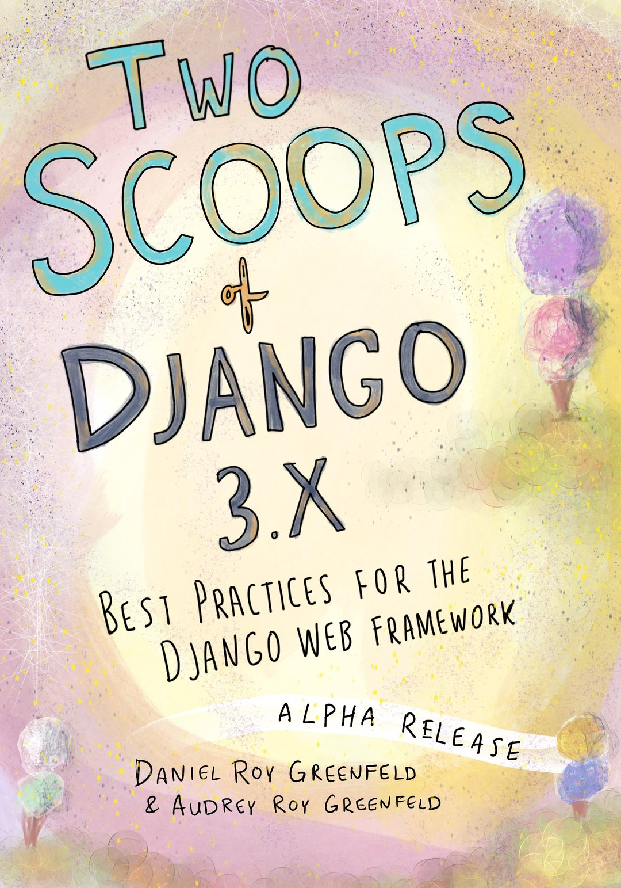
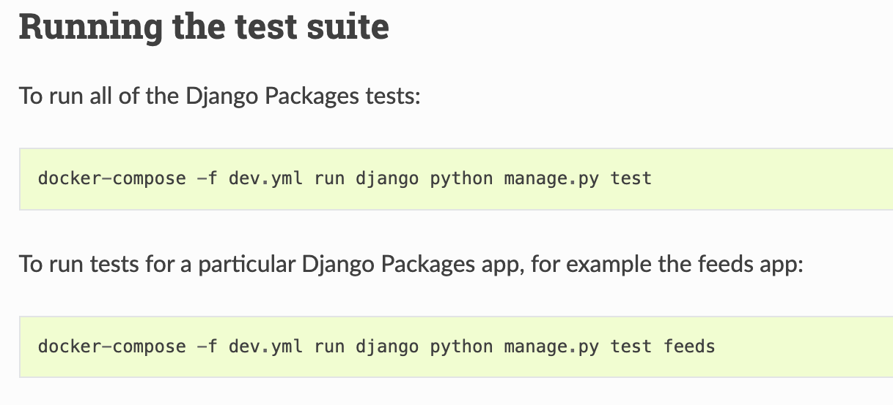
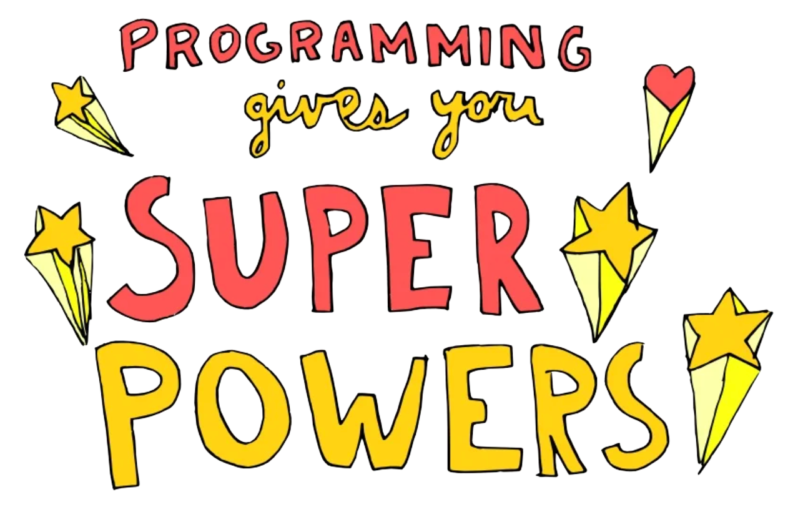

slidenumbers: true
autoscale: true
slide-transition: true

[.background-color: #003c80]
[.header: #FFFFFF, Avenir Next Bold]
[.text: #FFFFFF, Avenir Next Bold]

# [fit] Scaling from One to Billions

# [fit] How to change the world as a software engineer

Daniel Roy Greenfeld

---

[.background-color: #003c80]
[.header: #FFFFFF, Avenir Next Bold]
[.text: #FFFFFF, Avenir Next Bold]

# [fit] Scaling from One to Billions

# [fit] How to change the world as a software engineer

Daniel Roy Greenfeld

---

[.background-color: #003c80]
[.header: #FFFFFF, Avenir Next Bold]

# [fit] Olá Portugal!


---

# [fit] What this talk is about

- What we do at an individual level scales up
- What happens when what we do scales up?

---

# [fit] What this talk is about

- What we do at at individual level scales up
- What happens when what we do scales up?

# [fit] Let's go!

---

# Way back in

# [fit] 2004

---

[.background-color: #90EE90]

# [fit] I had long hair


---

[.background-color: #ecd540]

# Got interview at NASA


---

[.background-color: #FF0000]
[.header: #FFFFFF, Avenir Next Bold]

# [fit] 😞

# [fit] No way I was going to work for NASA

---

[.background-color: #FF0000]
[.header: #FFFFFF, Avenir Next Bold]
[.text: #FFFFFF, Avenir Next Bold]

# [fit] No computer science degree

# [fit] Only 7 years professional experience

---

# [fit] Plan

---

# [fit] Treat interview as a practice session


### Still from Jackie Chan's 1984 movie "Meals of Wheels"

---

# [fit] Test new approaches to typical questions


---

[.background-color: #00FFFF]

# [fit] Have fun!

---

# [fit] How it went

---

# [fit] **"What's your biggest weakness?"**

## - NASA Interviewer

---

<br><br>

# **"My biggest weakness is that I'm emotionally tied to my work so if I'm not doing well I take it personally. Then I work longer and harder to improve."**

## - My normal response

---

[.background-color: #ecd540]

# This time:

<br>

# [fit] "I'm stupid and lazy"

---

[.background-color: #FF0000]
[.header: #FFFFFF, Avenir Next Bold]

# NASA Interviewer

<br>

# [fit] "WTF?!"

---

[.background-color: #FF0000]
[.header: #FFFFFF, Avenir Next Bold]

# NASA Interviewer

<br>

# [fit] "You going to explain that?"

---

[.background-color: #ecd540]

# [fit] I'm stupid

---

# I'm stupid

- Can't figure things out
- Can't remember things
- Too stupid not to ask stupid questions

---

# [fit] Let's go over each item

---

### I'm stupid

## Can't figure things out

---

[.background-color: #00FFFF]

### I'm stupid

## Can't figure things out

# Always look for libraries first

---

## Can't figure things out

# OMG argparse

```python
import argparse

# sub-command functions
def foo(args):
    print(args.x * args.y)

def bar(args):
    print('((%s))' % args.z)

# create the top-level parser
parser = argparse.ArgumentParser()
subparsers = parser.add_subparsers()

# create the parser for the "foo" command
parser_foo = subparsers.add_parser('foo')
parser_foo.add_argument('-x', type=int, default=1)
parser_foo.add_argument('y', type=float)
parser_foo.set_defaults(func=foo)

# create the parser for the "bar" command
parser_bar = subparsers.add_parser('bar')
parser_bar.add_argument('z')
parser_bar.set_defaults(func=bar)

parser.parse_args()
```

---

## Can't figure things out

# Yay Typer!

```python
import typer

app = typer.Typer()


@app.command()
def foo(y: float, x: int = 1 ):
    print(x * y)

@app.command()
def bar(z: str):
    print(f'(({z}))')


if __name__ == '__main__':
    app()
```

---


# [fit] [typer.tiangolo.com](https://typer.tiangolo.com/)

---

[.background-color: #00FFFF]

### I'm stupid

## Too stupid not to ask stupid questions

---

[.background-color: #00FF00]

## _hint:_

# There are no stupid questions

---

[.background-color: #00FFFF]

## _hint:_

# The only bad question is the one you do not ask

---

[.background-color: #00FF00]

## _important professional advice:_

# Don't try to impress people by not asking questions

---

[.background-color: #00FFFF]

### Ashamed to ask questions?

## No one cares

## No one remembers

---

## Too stupid not to ask stupid questions

# Obey the Thirty Minute Rule

# [fit] [daniel.feldroy.com/30](https://daniel.feldroy.com/30-minute-rule)


---

# Obey the Thirty Minute Rule

## Don't waste more than 30 minutes on a problem without asking questions

---

# Obey the Thirty Minute Rule

## Change to 60 minutes if you like

---

# Important: Don't be a jerk and not let other people ask questions


---

## I'm stupid

# Can't remember things

---

[.background-color: #00FFFF]

## Can't remember things

# Docstrings are awesome

---

[.background-color: #00FF00]

## Can't remember things

# Typehints are awesome too, use them to reduce docstrings

---

# Remember this?

## Typehints means we don't have to write so many docs

```python
import typer

app = typer.Typer()


@app.command()
def foo(y: float, x: int = 1 ):
    print(x * y)

@app.command()
def bar(z: str):
    print(f'(({z}))')


if __name__ == '__main__':
    app()
```

---

### Can't remember things

## When following a talk or tutorial,

# Write down even the slide bullets!

---

# For most people writing down notes enhances learning

---

## I'm stupid

# Can't remember things

Me back in the day:

- [pydanny-event-notes.readthedocs.io/](https://pydanny-event-notes.readthedocs.io/)
- [daniel.feldroy.com/posts/2011-12-story-of-live-noting](https://daniel.feldroy.com/posts/2011-12-story-of-live-noting)

---

### I'm stupid

## Can't remember things

# Documentation makes

# me look good!

---

## Documentation makes me look good!

# I can pull out old tech details that others don't have

---

[.background-color: #ecd540]

## Documentation makes me look good!

# Can be used later on other projects

---

## Documentation makes me look good!

# Great for book content



---

## Documentation can make you look good too:

# [docs.djangoproject.com](https://docs.djangoproject.com)

# [docs.python-requests.org](https://docs.python-requests.org/)

# [fastapi.tiangolo.com](https://fastapi.tiangolo.com/)


---

[.background-color: #ecd540]

# [fit] I'm lazy

---

# I'm lazy

- Don't wanna do anything twice
- Don't wanna debug code when I had it working before
- Don't wanna look hard for docs

---

# [fit] Here we go on laziness!

---

### I'm lazy

## Don't wanna do anything twice

# If I write the same code twice I stick in a function

---

### I'm lazy

## Don't wanna do anything twice

# I use typehints so I write less docs

---

### I'm lazy

## Don't wanna do anything twice

# I stick the function into a `utils` module

---

### I'm lazy

## Don't wanna do anything twice

# I put the function on GitHub so I don't lose it

---

### I'm lazy

## Don't wanna do anything twice

# I put the project on PyPI so I can install it easily

---

### I'm lazy

## Don't wanna do anything twice

# Isn't this the foundation of open source?

---

[.build-lists: true]

## I'm lazy

# Don't wanna debug code that worked before

- Manually testing code by watching it run is hard
- ...and boring
- ...and hence is error prone
- ...meaning you have to do more work

---

### I'm lazy

## Don't wanna debug code when I had it working before

# Write down how to test lest you forget



---

## I'm lazy

# Don't wanna look hard for docs

Every project should have a README that covers:

- Installation
- Running the code
- Testing the code

---

# [fit] Did I get the job at NASA?

<br>

# [fit] ?

---

[.background-color: #ecd540]

# [fit] Yes

---

# [fit] In hindsight I was lucky

---

# [fit] Thank you

# [fit] Sharon Campbell

---

# [fit] One of my favorite managers ever

# [fit] Sharon Campbell

### If you're watching this, please contact me,

### Octopus Energy 🐙 could use your talents

---

# [fit] Worked at NASA 2005-2010

- Got started in Python (Thanks Chris Shenton)
- Met my wife
- Open sourced my first code:

  - What became django-crispy-forms

- **Learned about climate change**
- Coded a lot


---

# [fit] Worked at NASA

## Got educated about global climate change


---

# [fit] Doing what I could as an individual

- Recycling
- Composting
- Reduce my carbon load

---

[.background-color: #FF0000]
[.header: #FFFFFF, Avenir Next Bold]
[.text: #FFFFFF, Avenir Next Bold]

# [fit] Doing what I could as an individual

- Recycle?
- Compost?
- Reduce my carbon load?

# Does any of that make a difference?

---

[.background-color: #FF0000]
[.header: #FFFFFF, Avenir Next Bold]
[.text: #FFFFFF, Avenir Next Bold]

# [fit] Individual effort vs.

- Gigantic fossil fuel interests?

- Politicians across the planet?

- People who deny the 99% scientific consensus?

---

# [fit] What could I do as an individual?

## Let's return to this later...

---

# [fit] Worked at NASA 2005-2010

- Got started in Python (Thanks Chris Shenton)
- Met my wife
- Open sourced my first code:

  - What became django-crispy-forms

- Learned about climate change
- **Coded a lot**


---

[.background-color: #ecd540]

# [fit] Coded a Lot

---

# [fit] Code, Code, Code

# [fit] [daniel.feldroy.com/posts/code-code-code](https://daniel.feldroy.com/posts/code-code-code)

---

[.background-color: #00FF00]

## [fit] If you want to get good at anything

# [fit] Practice

---

[.background-color: #00FF00]

## [fit] Practice what you learn from this event

# [fit] Use It

---

[.background-color: #00FFFF]

# [fit] Always be typing

---

# [fit] Pairing is great

---

# [fit] But if you're trying to improve?

---

[.background-color: #00FFFF]

# [fit] Always be the person typing

---

# [fit] Taking a class?

---

[.background-color: #00FFFF]

# [fit] Always be typing

---

# [fit] No exercises in the class?

---

[.background-color: #FF0000]
[.header: #FFFFFF]

# [fit] Then you are watching

# [fit] a spectator sport

---

# [fit] You will learn as a spectator

# [fit] just not as fast

# and...

---

[.background-color: #FF0000]
[.header: #FFFFFF]

# [fit] Mastery can't be

# [fit] found as a spectator

---

# [fit] "You can't become a tech CEO by

# [fit] watching the social network"

---

# [fit] You can't win at

# [fit] sports by watching TV

---

# [fit] To master anything...

---

# [fit] To master coding...

---

[.background-color: #00FF00]

# [fit]... you have to practice

---

[.background-color: #00FF00]

# [fit] Practice makes perfect

---

[.background-color: #00FFFF]

# [fit] Always be typing

---

# [fit] Code, Code, Code

# [fit] [daniel.feldroy.com/posts/code-code-code](https://daniel.feldroy.com/posts/code-code-code)

---

# Diving into open source

# [fit] 2010 onwards

Powered by my own stupid laziness and desire to practice

_(plus the rush when others liked my work)_

---

# Open source

A sampling powered by my own stupid laziness and desire to practice

- django-uni-form => django-crispy-forms
- Django Packages
- Django CBV docs refactor
- Cookiecutter
- Cookiecutter Django
- cached-property

---

# 2013 onwards: Sharing Django tribal knowledge


---

# [fit] Sharing

# [fit] code and knowledge

# [fit] is awesome!

---

# [fit] My work used for good

- People using it to land jobs
- Building dream projects
- Various community service efforts
  - Health care firms
  - Charities and non-profits
  - Catching terrorist bombers (Boston Marathon 2013)

---

[.background-color: #FF0000]
[.header: #FFFFFF, Avenir Next Bold]
[.text: #FFFFFF, Avenir Next Bold]

# [fit] But what about when

# [fit] my work is used for

# [fit] evil?

---

[.background-color: #FF0000]
[.header: #FFFFFF, Avenir Next Bold]
[.text: #FFFFFF, Avenir Next Bold]

# [fit] But what if my work was used for evil?

Things built off my open source and books:

- Site promoting flat earth / no moon landings
- App to sell wildlife illegally
- Commercial venture to spy on private citizens
- Lots more

# :rage:

---

# [fit] Ethics in Code


---

# [fit] Questions we should ask of every employer/client

---

# [fit] Who is helped?

---

# [fit] Who is hurt?

---

# [fit] Does this project:

- Promote falsehood over truth?
- Subvert election processes?
- Intrude on individual sovreignty?
- Spew unnecessary carbon into the atmosphere?

## In other words, does this hurt our future?

---

# [fit] Does this hurt our future?

Climate change is real

- A series of incrementally hotter years
- In 2022 Europe and South Asia suffered a devastating heat wave
- The South Western USA is under severe water restrictions

---

<sub>This isn't Southern California, rather Auburge, France 2022.</sub>


---

# [fit] It doesn't have to be this way...

---

## [fit] ...and here's why

---



---

# [fit] Programming Gives Us Super Powers

- To improve the lives of ourselves and our families
- To build new and innovative businesses
- To share ideas and knowledge around the world

---

# [fit] Programming Gives Us Super Powers

- To improve the lives of ourselves and our families
- To build new and innovative businesses
- To share ideas and knowledge around the world
- **To save the planet**


---

[.background-color: #FF0000]
[.header: #FFFFFF, Avenir Next Bold]
[.text: #FFFFFF, Avenir Next Bold]

### My impact on climate as an individual is tiny

---

[.build-lists: true]
[.background-color: #00FF00]

# [fit] My climate impact as a software developer

# [fit] working on decarbonization and electrification

# [fit] Gigantic

---

[.build-lists: true]
[.background-color: #00FF00]


# [fit] This is going to be my legacy

---

[.build-lists: true]
[.background-color: #00FF00]

# [fit] Join me in the good fight against climate change

[.column]

- Octopus Energy is hiring
  - _We have a booth at DjangoCon!_
- Or go work for a competitor
- Doesn't matter which green firm "wins", we all benefit

[.column]


---

[.background-color: #c9e9f6]

# [fit] Questions

# [fit] 🤔

---

# [fit] Links

- [https://daniel.feldroy.com/posts/thirty-minute-rule](daniel.feldroy.com/posts/thirty-minute-rule)
- [https://daniel.feldroy.com/posts/code-code-code](daniel.feldroy.com/posts/code-code-code)
- [pydanny-event-notes.readthedocs.io/](https://pydanny-event-notes.readthedocs.io/)
- [daniel.feldroy.com/posts/2011-12-story-of-live-noting](https://daniel.feldroy.com/posts/2011-12-story-of-live-noting)
- [typer.tiangolo.com/](https://typer.tiangolo.com/)
- [fastapi.tiangolo.com/](fastapi.tiangolo.com/)
- [octopus.energy/careers/join-us/](https://octopus.energy/careers/join-us/)
